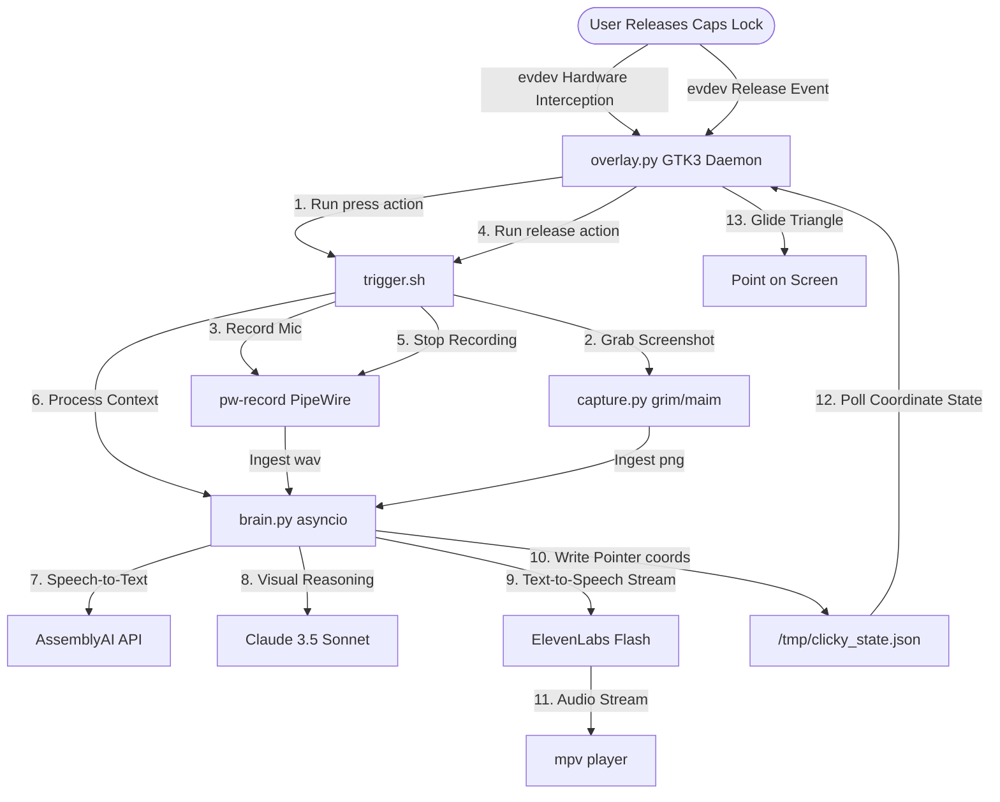

# HeyClicky Linux Port 🐧

HeyClicky Linux is a voice-driven, screen-aware AI assistant built natively for Linux environments. It runs as a lightweight background daemon that captures your active screen and microphone when you hold down a hardware hotkey, queries Claude 3.5 Sonnet for vision-aware reasoning, and streams natural spoken audio back to you almost instantly.

Unlike the macOS version, this port bypasses heavy app frameworks and sandboxed display protocols, leveraging native Linux command-line utilities and hardware-level keypress capturing for ultra-low latency.

---

## Features

- **Hardware-Level Push-To-Talk**: Intercepts `Caps Lock` presses and releases directly via `/dev/input/` (using `evdev`), providing true push-to-talk capability across Wayland (Hyprland, GNOME, KDE) and X11 out-of-the-box.
- **Adaptive Screen Grabbing**: Automatically detects the session type and uses native, silent screenshot tools (like `grim` on Wayland/wlroots or `maim` on X11) to capture your desktop in milliseconds.
- **Low-Latency Streaming Speech**: Streams text responses from Claude and feeds ElevenLabs TTS audio chunks directly to `mpv`'s input stream for instant real-time playback.
- **Sleek HUD Overlay**: Renders an animated, glowing neon-blue pointer cursor and custom tooltip speech bubble using GTK3 (`PyGObject`) and Cairo, which is 100% click-through.
- **AppImage Distribution**: Packaged as a single standalone executable binary.

---

## Architecture Diagram



---

## Running the Application

Since a pre-compiled `HeyClicky-x86_64.AppImage` is tracked directly in the repository root, you can run the application immediately after cloning:

### 1. Make the AppImage Executable
```bash
chmod +x HeyClicky-x86_64.AppImage
```

### 2. Run the Integrated Setup
Execute the setup command directly through the AppImage (this will install system packages and configure input device permissions in one step):
```bash
./HeyClicky-x86_64.AppImage setup
```

### 3. Run the Daemon
Launch the background overlay HUD and hotkey listener:
```bash
./HeyClicky-x86_64.AppImage daemon &
```

---

## Autostart Integration

To run HeyClicky automatically when your system starts:
- **For AppImage**: Add `/path/to/HeyClicky-x86_64.AppImage daemon &` to your desktop environment startup applications.
- **For Python script**: A desktop file is automatically generated at `~/.config/autostart/clicky-daemon.desktop` by the installer pointing to the virtual environment python interpreter.

---

## Development

If you make modifications to the Python or Bash scripts inside the `src/` directory, you can rebuild the AppImage using the compiler script:
```bash
chmod +x src/build_appimage.sh
./src/build_appimage.sh
```
This will compile your modifications and overwrite the `HeyClicky-x86_64.AppImage` binary in the root directory.
